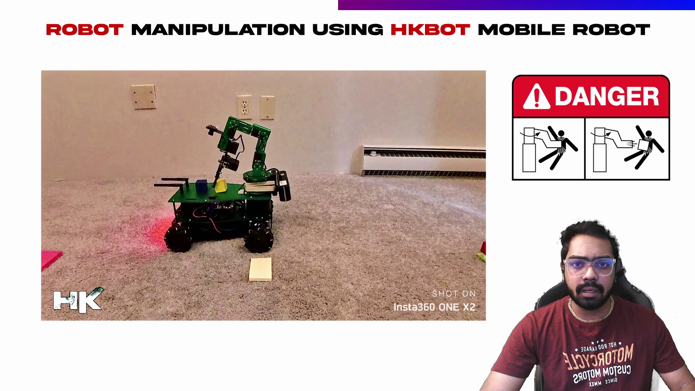
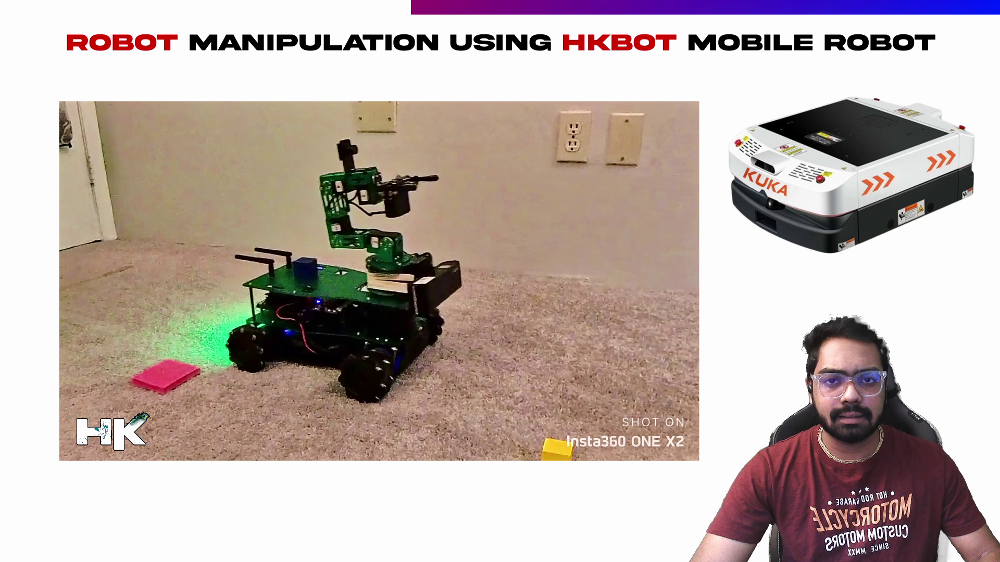

<!------ Copyrights ------>

© 𝗗𝗼𝗰𝘂𝗺𝗲𝗻𝘁𝗮𝘁𝗶𝗼𝗻 𝗯𝘆 𝘁𝘃𝗵𝗮𝗿𝗶𝗸𝗿𝗶𝘀𝗵𝗻𝗮

5 𝘮𝘪𝘯𝘶𝘵𝘦 𝘳𝘦𝘢𝘥 📚 
  

<!------ PROJECT TITLE ------>

    

    

<!------ WHAT ------>

    

<h1>🎀 Essence of the Project</h1>

▸ I have developed a specialized algorithm for a custom-built mobile robot that utilizes an NVIDIA Jetson Nano and a 6-DOF robotic arm for block manipulation tasks. The robot is designed with mecanum wheels, which enable omnidirectional movement, allowing the robot to maneuver with precision in any direction. Safety protocols and measures have been rigorously integrated to ensure the robot operates within the guidelines for mobile robots and autonomous guided vehicles. 

▸ The algorithm efficiently manages the 'pick and place' operations, placing blocks onto the robot's chassis, adapting dynamically to the payload configuration, and optimizing the spatial arrangement to accommodate additional blocks.

  

    

<!------ WHY ------>

    

<h1>🎯 Project Vision</h1>

The project is dedicated to revolutionizing block manipulation tasks through the development of a specialized algorithm and the integration of advanced technology, including an NVIDIA Jetson Nano and a 6-DOF robotic arm. Here are the key benefits of this innovative project in the realm of autonomous mobile robotics:

▸ <code>Enhanced Operational Efficiency:</code> Utilizing a sophisticated algorithm to optimize 'pick and place' operations, significantly reducing execution time and resource use.

▸ <code>Innovative Robotic Mobility:</code> The use of mecanum wheels facilitates omnidirectional movement, allowing for precise and versatile maneuvering, enhancing automation in logistics and beyond.

▸ <code>Safety Protocol Integration:</code> Rigorous safety measures ensure the robot's operation adheres to the highest standards for mobile robots and autonomous guided vehicles, promoting a secure working environment.

▸ <code>Dynamic Adaptation:</code> The robot's ability to adjust dynamically to various payload configurations and optimize spatial arrangements for block placement demonstrates advanced adaptability in automated tasks.

    

<!------ HOW ------>

    

<h1>🪓 Project Implementation</h1>

<h2>💠 Software Design & Tools </h2>

My project's implementation is centered around a highly efficient and adaptable software architecture, utilizing cutting-edge technology and innovative design principles:

▸ <strong>Specialized Algorithm:</strong> Leveraging the NVIDIA Jetson Nano, I crafted a tailored algorithm designed for precise and efficient 'pick and place' operations. This algorithm optimizes block manipulation with an emphasis on speed and accuracy.

▸ <strong>Machine Learning Models:</strong> I employed advanced object recognition and spatial awareness models to facilitate real-time decision-making. This enables the robot to dynamically adapt to new payloads and ensures optimal placement of blocks.

▸ <strong>Hardware Integration:</strong> I ensured seamless control over the robot's 6-DOF arm and mecanum wheels through the use of custom PCBs and high-quality components. This integration achieves precise maneuverability and task execution.

▸ <strong>Safety First:</strong> I embedded rigorous safety protocols into the project to guarantee operation within the guidelines for autonomous vehicles. This prioritizes the safety of both the robot and its surrounding environment.

 &nbsp;
 &nbsp;
 &nbsp;
 &nbsp;
 &nbsp;
 &nbsp;
 &nbsp;
 &nbsp;
 &nbsp;
 &nbsp;

<!------ Deployment and Testing ------>

<h2>💠 Deployment and Testing</h2>

    

<h2>▸ Manipulation Sequence Planning</h2>

▸ I have designed the algorithm for the robotic arm in a way that is referred to as 'manipulation sequence' or 'manipulation planning' in robotics. When the robot's chassis already holds one or two blocks, it needs space to place an additional block. My developed algorithm directs the arm to push the existing blocks slightly backward, creating room for the new one. This process can repeat for any number of blocks, as demonstrated in the video.

<h2>▸ Implemented Safety Measures for Operating AMRs/AGVs</h2>

As we all know, robots can pose a hazard if we enter their operational zone. To address safety concerns on sites and factories that use mobile robots and Autonomous Guided Vehicles (AGVs), I have programmed an algorithm to enhance safety communications. When the robot is performing a manipulation task, it emits a flashing red light. Conversely, when the robot is merely moving around, it emits a green light, signaling to humans that it is safe to approach. However, it is unsafe to approach when the robot flashes a red light. 

<h2>Red: Danger</h2>

  

<h2>Green: Safe</h2>

  

 

<!------ End Image ------>

    

