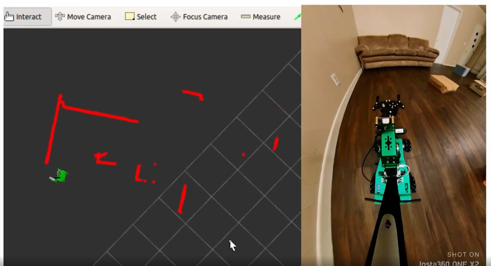

<!------ PROJECT TITLE ------>

    

    

<!------ WHAT ------>

    

 

<h1>🎀 Essence of the Project</h1>

This project introduces the HK Bot, a custom-made mobile robot designed for autonomous navigation. It uses YdLidar technology for accurate environmental scanning and is built on the Robot Operating System (ROS), providing a robust and flexible platform for programming robots. Additionally, the robot's spatial data and sensor inputs are displayed using rviz, ROS's 3D visualization tool, which helps in plotting 2D LiDAR points to thoroughly understand the robot's perception and navigation capabilities.

  

 
    

<!------ WHY ------>

    

<h1>🎯 Project Vision</h1>

This project focuses on advancing obstacle avoidance technology, essential for the safety and efficiency of autonomous mobile robots and vehicles. It aims to enhance autonomous navigation in complex environments by incorporating real-time decision-making capabilities. Obstacle avoidance is crucial for preventing collisions, particularly in unpredictable settings. This technology allows autonomous machines to adapt quickly to new obstacles, improving the reliability and effectiveness of services like automated delivery or emergency aid. Additionally, it reduces the need for human oversight, advancing autonomous driving and contributing to safer roads.

 
    

<!------ HOW ------>

    

<h1>🪓Project Implementation</h1>

<h2>💠 Software Design & Tools </h2>

The project is developed using a robust and versatile tech stack, comprising Ubuntu and Linux for the operating systems, Python as the primary programming language, and utilizing essential tools like SSH, PuTTY, and VNC Viewer for secure remote connections. Development and simulation are enhanced with the ROS ecosystem, including RViz for visualization.

 &nbsp;
 &nbsp;
 &nbsp;
 &nbsp;
 &nbsp;
 &nbsp;
 &nbsp;
 &nbsp;
 &nbsp;
 &nbsp;

  

<!------ Technical Terms ------>

<h2>💠 Project Technical Terms & Concepts</h2>

<h3>▸ What is YdLidar:</h3>

YdLiDAR is a type of Light Detection and Ranging (LiDAR) sensor designed for use in robotics and automation. LiDAR sensors measure distances by illuminating targets with laser light and measuring the reflection with a sensor. YdLiDAR sensors are known for their cost-effectiveness and compact size, making them suitable for applications like obstacle avoidance, area mapping, and robot navigation where precise distance measurements and environmental awareness are crucial.

  

  

<h3>▸ How Does Lidar Work:</h3>

TOF (Time of Flight) LiDAR is a technology that calculates the distance to a target by measuring the travel time of a light pulse. The process begins when a laser transmitter emits a beam of modulated light. This light travels to the target, bounces back, and is then detected by the laser receiver in the LiDAR system. The core of TOF LiDAR's functionality lies in its ability to discern the phase difference between the light sent out and the light that returns. By accurately measuring this phase shift, the system can calculate the precise distance to the object with remarkable accuracy, making TOF LiDAR an essential tool for detailed spatial measurements and mapping.

  <table>
    <tr>
      <td rowspan="2"></td>
      <td></td>
    </tr>
    <tr>
      <td></td>
    </tr>
  </table>

<!------ Deployment and Testing ------>

<h2>💠 Deployment and Testing</h2>

▸ During the deployment and testing phase, the mobile robot was equipped with the aforementioned tools and sensors, which facilitated the implementation of the project. By integrating these technologies, the robot was able to perform autonomous navigation and obstacle avoidance. 
    
▸ The real-world performance of the robot was validated by plotting a 2D scan of its environment, which was then visualized in the rviz tool. This visualization provided a clear and detailed representation of how the robot perceives and interacts with its surroundings, demonstrating the effectiveness of the technologies in practical scenarios.

  

<!------ End Image ------>

  

 

<!------ End Image ------>

    

