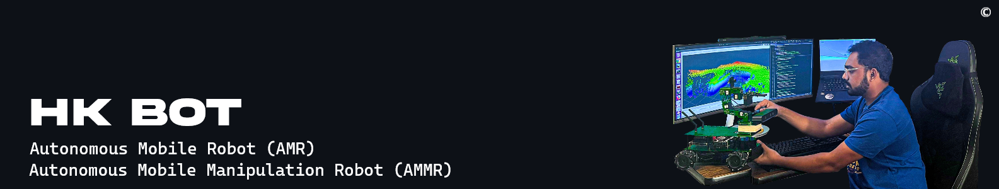

<!------ PROJECT TITLE ------>

    

    

<!------ WHAT ------>

    

<h1>🎀 Essence of the Project</h1>

The SLAM Gmapping project employs Simultaneous Localization and Mapping (SLAM) using Gmapping to enable real-time navigation and environment mapping. By processing LiDAR data, it creates detailed maps while tracking the robot's position. This project is key for autonomous robots, providing them with spatial awareness, adaptive navigation, and precise path planning in unfamiliar surroundings.

  

 
    

<!------ WHY ------>

    

<h1>🎯 Project Vision</h1>

The vision for the SLAM Gmapping project is to revolutionize how autonomous systems perceive and interact with their environment. It aims to create sophisticated, self-updating maps while navigating in real-time, allowing for seamless movement and obstacle avoidance in complex, dynamic environments. Ultimately, this project aspires to set a new standard for adaptability and reliability in autonomous exploration.

 
    

<!------ HOW ------>

    

<h1>🪓Project Implementation</h1>

<h2>💠 Software Design & Tools </h2>

The project is developed using a robust and versatile tech stack, comprising Ubuntu and Linux for the operating systems, Python as the primary programming language, and utilizing essential tools like SSH, PuTTY, and VNC Viewer for secure remote connections. Development and simulation are enhanced with the ROS ecosystem, including RViz for visualization.

 &nbsp;
 &nbsp;
 &nbsp;
 &nbsp;
 &nbsp;
 &nbsp;
 &nbsp;
 &nbsp;
 &nbsp;
 &nbsp;

  

<!------ Technical Terms ------>

<h2>💠 Project Technical Terms & Concept </h2>

<h3>▸ What is SLAM?</h3>

SLAM (Simultaneous Localization and Mapping) is a technology that allows a robot or a vehicle to create a map of its surroundings while simultaneously determining its location within that map. This is crucial for navigation in environments where GPS is unavailable or unreliable.

  

<h3>▸ What are types of SLAM?</h3>

There are several types of SLAM, each suited to different applications. The main types include Visual SLAM (V-SLAM), which uses cameras, Lidar SLAM, which uses laser scanners, and Sensor Fusion SLAM, which combines multiple sensors. Each type has its advantages, depending on the specific requirements of the environment and the task.

  

<h3>▸ What is Gmapping?</h3>

GMapping is a specific implementation of SLAM that uses a particle filter to produce a 2D map from Lidar data. It is widely used in robotics for its efficiency and accuracy in mapping indoor environments. GMapping helps robots navigate and understand their environment by providing a detailed spatial layout.

  

<!------ Deployment and Testing ------>

<h2>💠 Deployment and Testing</h2>

    

  

  

  

  

<!------ Result and Analysis ------>

<h2>💠 Results & Analysis </h2>

▸ The SLAM Gmapping project's results demonstrate a marked improvement in map accuracy through the use of morphological operations. The original map (`my_map.pgm`) contains noise and gaps that hinder accurate environment mapping. Applying operations like erosion and dilation with different kernel sizes enhances boundary detection and closes gaps effectively. The refined map, visible at the bottom right of the image, shows a clear and precise representation of the space.

▸ The initial morphological operations (kernel size 1) reduce noise and delineate boundaries better than the raw map. Further refinement (kernel size 2) creates a high-quality map with smooth edges, filled gaps, and accurate obstacle representation.

▸ This map refinement technique improves the quality and usability of the generated maps significantly, ensuring accurate navigation and planning. By leveraging computer vision methods, this approach provides robust solutions for noise reduction and enhances the overall quality of SLAM-based maps.

  

     

<!------ End Image ------>

    

