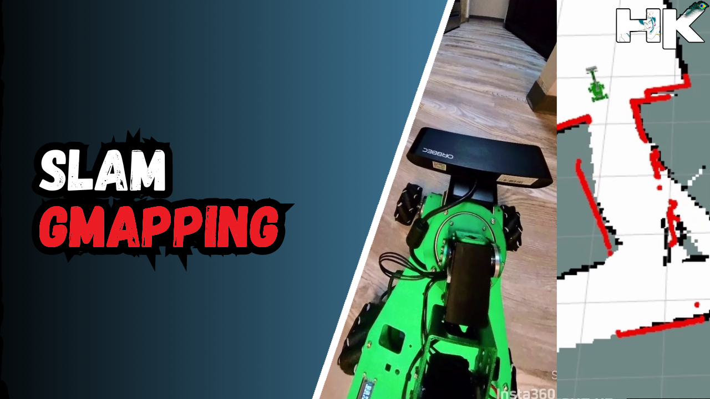

<!------ Copyrights ------>

© 𝗗𝗼𝗰𝘂𝗺𝗲𝗻𝘁𝗮𝘁𝗶𝗼𝗻 𝗯𝘆 𝘁𝘃𝗵𝗮𝗿𝗶𝗸𝗿𝗶𝘀𝗵𝗻𝗮

5 𝘮𝘪𝘯𝘶𝘵𝘦 𝘳𝘦𝘢𝘥 📚 
  

<!------ PROJECT TITLE ------>

    

 
  

<!------ WHAT ------>

    

<h1>🀠Essence of the Project</h1>

▸ This project showcases the HK Bot, an innovative custom made mobile robot engineered for autonomous navigation and proficient obstacle avoidance. It incorporates YdLidar technology for high-precision environmental scanning and leverages the Robot Operating System (ROS) to offer a sturdy and adaptable platform for robot programming. 

▸ Furthermore, the system's spatial data and sensor inputs are visualized using rviz, ROS's 3D visualization tool, allowing for the plotting of 2D LiDAR points for a comprehensive understanding of the robot's perception and navigation capabilities. 

  

 
  

<!------ WHY ------>

    

<h1>🯠Project Vision</h1>

The project is dedicated to advancing obstacle avoidance technology, a cornerstone for the safety and operational effectiveness of autonomous mobile robots and vehicles. Incorporating real-time decision-making capabilities, this project aims to enhance autonomous navigation in complex environments. Here are the key benefits that obstacle avoidance systems contribute to the field of autonomous mobility:
 
    
▸ <code>Essential Safety Mechanism:</code> Obstacle avoidance is vital for autonomous systems, enabling safe navigation without collisions, especially in dynamic or unpredictable settings.

▸ <code>Real-time Decision Making:</code> This technology empowers autonomous machines to instantly adapt to new obstacles, ensuring efficient and reliable task execution for services like automated delivery or emergency aid.

▸ <code>Human Intervention Reduction:</code> By leveraging obstacle avoidance, the need for human oversight decreases, pushing the boundaries in autonomous driving and contributing to fewer traffic incidents and enhanced road safety.

 
  

<!------ HOW ------><!------ HOW ------><!------ HOW ------>

    

<h1>🪓Project Implementation</h1>

<h2>💠 Software Design & Tools </h2>

The project is developed using a robust and versatile tech stack, comprising Ubuntu and Linux for the operating systems, Python as the primary programming language, and utilizing essential tools like SSH, PuTTY, and VNC Viewer for secure remote connections. Development and simulation are enhanced with the ROS ecosystem, including RViz for visualization. 

 &nbsp;
 &nbsp;
 &nbsp;
 &nbsp;
 &nbsp;
 &nbsp;
 &nbsp;
 &nbsp;
 &nbsp;
 &nbsp;

<h2>▸ What is YdLidar:</h2>

YdLiDAR is a type of Light Detection and Ranging (LiDAR) sensor designed for use in robotics and automation. LiDAR sensors measure distances by illuminating targets with laser light and measuring the reflection with a sensor. YdLiDAR sensors are known for their cost-effectiveness and compact size, making them suitable for applications like obstacle avoidance, area mapping, and robot navigation where precise distance measurements and environmental awareness are crucial. 
  

  

<h2>▸ How Does Lidar Work:</h2>

TOF (Time of Flight) LiDAR is a technology that calculates the distance to a target by measuring the travel time of a light pulse. The process begins when a laser transmitter emits a beam of modulated light. This light travels to the target, bounces back, and is then detected by the laser receiver in the LiDAR system.

The core of TOF LiDAR's functionality lies in its ability to discern the phase difference between the light sent out and the light that returns. By accurately measuring this phase shift, the system can calculate the precise distance to the object with remarkable accuracy, making TOF LiDAR an essential tool for detailed spatial measurements and mapping.

  <table>
    <tr>
      <td rowspan="2"></td>
      <td></td>
    </tr>
    <tr>
      <td></td>
    </tr>
  </table>

<!------ Deployment and Testing ------>

<h2>💠 Deployment and Testing</h2>

▸ During the deployment and testing phase, the mobile robot was equipped with the aforementioned tools and sensors, which facilitated the implementation of the project. By integrating these technologies, the robot was able to perform autonomous navigation and obstacle avoidance. 

▸ The real-world performance of the robot was validated by plotting a 2D scan of its environment, which was then visualized in the rviz tool. This visualization provided a clear and detailed representation of how the robot perceives and interacts with its surroundings, demonstrating the effectiveness of the technologies in practical scenarios.

  

<!------ End Image ------>

  

 
  

<!------ End Image ------>

    

