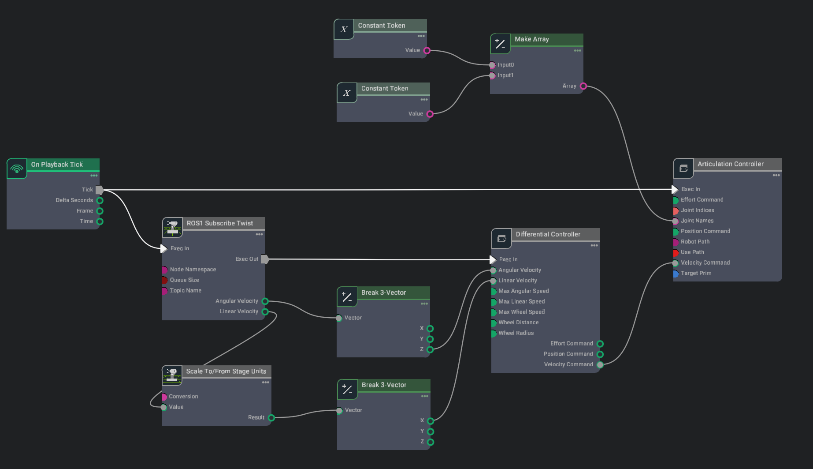

<!------ PROJECT TITLE ------>

    

    

<!------ WHAT ------>

    

<h1>🎀 Essence of the Project</h1>

An introductory project created in NVIDIA Isaac SIM, featuring the deployment and integration of the advanced NVIDIA Carter robot. Following Isaac's comprehensive guidelines, the project leverages visual scripting capabilities and enables intuitive keyboard-driven navigation of the robot within the simulation environment.

  

 
     

<!------ WHY ------>

    

<h1>🎯 Project Vision</h1>

The vision of this project is to demonstrate the practical applications of NVIDIA Isaac SIM by integrating the NVIDIA Carter robot into its ecosystem. The workflow starts with accurately deploying the robot model in the simulation, ensuring all physical properties and behaviors are represented correctly. The project employs visual scripting, a robust tool that allows defining complex robotic behaviors without traditional coding, enabling users to orchestrate intricate sequences and operations for the robot's autonomous functions. Additionally, the inclusion of keyboard navigation provides a hands-on method for users to interact directly with the robot, offering immediate feedback and control. This project showcases a streamlined process from simulation to real-world application, highlighting the ease with which users can simulate, visualize, and test robotic systems in a virtual yet realistic setting.

 
    

<!------ HOW ------>

    

<h1>🪓Project Implementation</h1>

<h2>💠 Software Design & Tools </h2>

The implementation of this project is rooted in a powerful and diverse toolkit, embracing both Ubuntu and Linux for robust operating system support, with Python as the backbone for scripting and automation. The project is built upon the ROS ecosystem and powered by the advanced capabilities of NVIDIA Isaac SIM for realistic simulation and testing.

 &nbsp;
 &nbsp;
 &nbsp;
 &nbsp;
 &nbsp;
 &nbsp;

   

<!------ Technical Terms ------>

<h2>💠 Project Technical Terms & Concepts </h2>

<h3>▸ What is Visual Scripting in Isaac?</h3>

Visual Scripting in NVIDIA Isaac SIM is a user-friendly interface that allows developers to create complex robot behaviors without writing traditional code. This tool utilizes a node-based approach where users can drag and connect different nodes that represent actions, sensors, or logic components. It simplifies the development process, making it accessible for users with limited programming experience, and accelerates the prototyping of robotic solutions. Visual scripting is especially beneficial in simulation environments where rapid iteration and testing are crucial for developing efficient robotic systems.

  

<!------ Deployment and Testing ------>

<h2>💠 Deployment and Testing</h2>
  

    

<h3>1. Import Assets</h3>

In this initial step, assets are imported into Isaac SIM. For this project, a warehouse environment was chosen as the testing ground, but users can select any robot and environment they prefer. This flexibility allows for varied applications and experimentation within the simulation.

<h3>2. Set Physics and Lighting</h3>

Setting up accurate physics and lighting is essential for realistic simulations. This step involves configuring the physical properties that affect robot interaction with the environment and adjusting lighting to enhance visual realism and perception, crucial for tasks involving visual processing.

  

<h3>3. Implement Visual Scripting</h3>

NVIDIA Isaac SIM introduces a powerful feature called visual scripting, which is utilized to design the robot's framework. This includes creating nodes for components like cameras, motors, and driver controls. Visual scripting allows for an intuitive setup of complex robotic functionalities without the need for traditional coding.

  

<h3>4. Run my Python File in src</h3>

After setting up the environment and carefully assigning values to the nodes in OG Graphs, the simulation is ready to be started. Run the Python script named `carter_robot_control.py` from the src directory to control the robot. This script handles the direct manipulation of the robot within the simulation.

<h3>5. Follow NVIDIA Documentation</h3>

For those new to NVIDIA Isaac SIM, it is recommended to <a href="https://docs.omniverse.nvidia.com/isaacsim/latest/ros_tutorials/index.html">follow the official NVIDIA documentation</a> to get a comprehensive understanding of the tools and features offered. This guidance will help ensure that all steps are correctly implemented and that users can maximize the platform's capabilities.

 
    

<!------ End Image ------>

    

