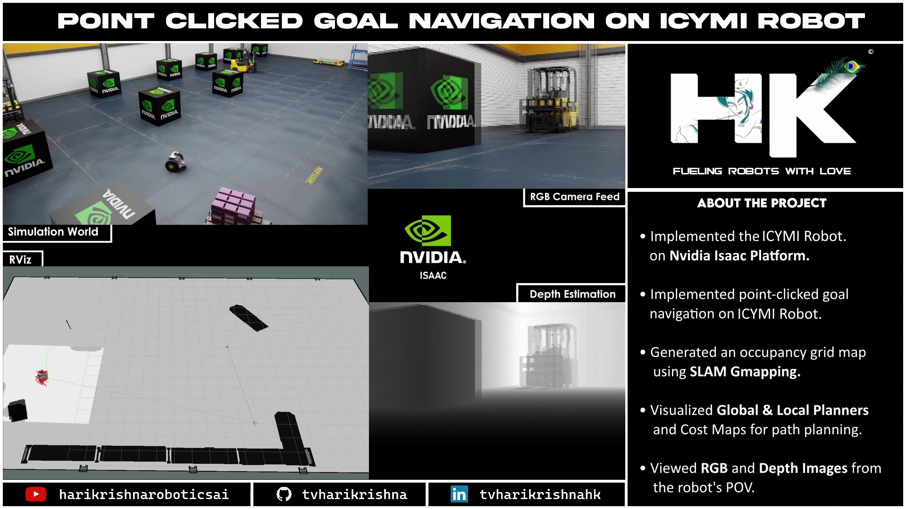

<!------ PROJECT TITLE ------>

    

    

<!------ WHAT ------>

    

<h1>🎀 Essence of the Project</h1>

The 'NVIDIA ICYMI Point Clicked Goal Navigation' project showcases the capabilities of the NVIDIA ICYMI robot in a simulated environment using the NVIDIA Isaac SIM platform. This project focuses on enhancing the robot's navigation abilities, allowing it to move towards a user-defined point within the environment. Utilizing advanced sensors and real-time processing, the robot efficiently navigates while avoiding obstacles, mapping its surroundings, and providing depth estimations and visual feedback through integrated RGB and depth cameras.

  

 
     

<!------ WHY ------>

    

<h1>🎯 Project Vision</h1>

The vision behind the NVIDIA ICYMI Point Clicked Goal Navigation project is to demonstrate a scalable and adaptable framework for autonomous robot navigation in dynamically changing environments. The goal is to push the boundaries of what autonomous systems can achieve in terms of precision navigation and environmental interaction, thereby paving the way for broader applications in industrial automation, logistics, and service sectors where advanced navigation is crucial.

 
     

<!------ HOW ------>

    

<h1>🪓Project Implementation</h1>

<h2>💠 Software Design & Tools </h2>

The implementation of this project is rooted in a powerful and diverse toolkit, embracing both Ubuntu and Linux for robust operating system support, with Python as the backbone for scripting and automation. The project is built upon the ROS ecosystem and powered by the advanced capabilities of NVIDIA Isaac SIM for realistic simulation and testing.

 &nbsp;
 &nbsp;
 &nbsp;
 &nbsp;
 &nbsp;
 &nbsp;

   

<!------ Technical Terms ------>

<h2>💠 Project Technical Terms & Concepts </h2>

<h3>▸ What is Nvidia's ICYMI Robot?</h3>

Nvidia's ICYMI (In Case You Missed It) Robot is a versatile robotic platform designed for research and development in the fields of robotics and artificial intelligence. It leverages Nvidia's cutting-edge hardware and software technologies to enable advanced functionalities like autonomous navigation, object recognition, and real-time environmental interaction.

  

<h3>▸ What is Point Clicked Goal Navigation in ROS?</h3>

Point Clicked Goal Navigation in ROS refers to a navigation technique where a robot moves to a target location selected by the user in a graphical interface. This is typically achieved by processing the click input to determine the target position in the robot's coordinate frame and then generating a path to that position while avoiding obstacles.

  

<h3>▸ What is an Occupancy grid?</h3>

An occupancy grid is a data structure used in robotics and autonomous vehicle navigation to represent the environment. It consists of a grid that divides the space into cells, where each cell holds a value indicating whether the area is occupied, free, or unknown. This helps the robot in path planning and navigation by providing a detailed map of the surroundings.

  

<h3>▸ What is SLAM Gmapping?</h3>

SLAM Gmapping is a technique used to create a map of an environment while simultaneously tracking the location of the robot within that map. It uses a particle filter-based approach to solve the SLAM (Simultaneous Localization and Mapping) problem, typically employing laser range finders to perceive the environment.

  

<h3>▸ What is a Global Path Planner?</h3>

A Global Path Planner is a component of robotic navigation systems that generates a feasible route from the robot's current position to a specified goal location over the entire map. It considers the known environment and calculates the most efficient path, often using algorithms like A* or Dijkstra’s algorithm.

  

<h3>▸ What is a Local Path Planner?</h3>

A Local Path Planner operates within the robot's immediate environment to dynamically adjust the robot's path in response to unforeseen obstacles or changes in the environment. It ensures the robot's safety by making quick decisions about path alterations to avoid collisions and optimize movement.

  

<h3>▸ What is the difference between RGB Image and Depth Image?</h3>

The difference between RGB Image and Depth Image lies in the type of information each provides. An RGB image captures the visual appearance of the environment in color, similar to what the human eye sees. A Depth image, on the other hand, provides the distance of surfaces from the camera's perspective, offering a 3D perception by measuring how far objects are from the point of view.

  

<!------ Deployment and Testing ------>

<h2>💠 Deployment and Testing</h2>
  

    

  

    

  

    

  

    

  

    

 
    

<!------ End Image ------>

    

