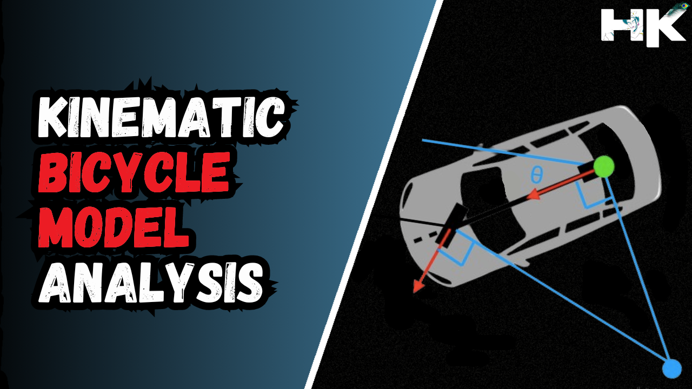
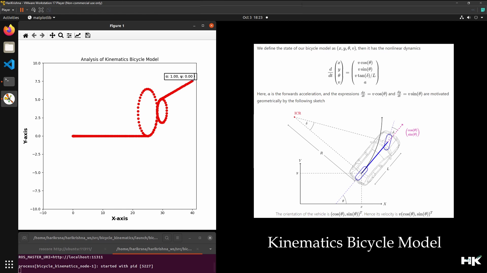
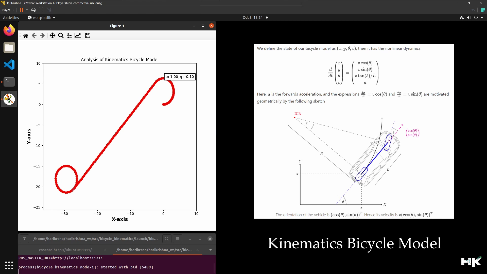
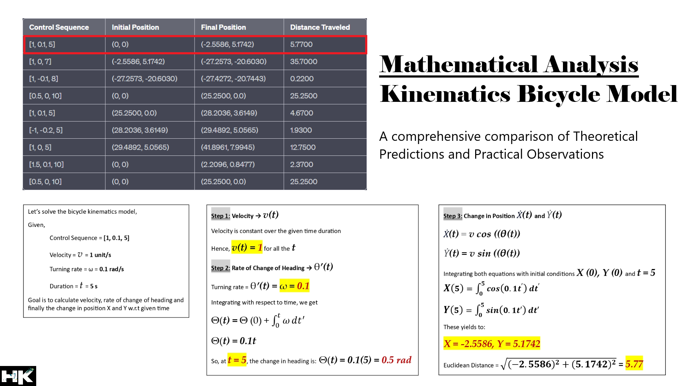

<!------ PROJECT TITLE ------>

    

    

<!------ WHAT ------>

    

<h1>🎀 Essence of the Project</h1>

The Bicycle Kinematic Model block creates a bicycle vehicle model to simulate simplified car-like vehicle dynamics. It represents a vehicle with two axles separated by the wheelbase. The vehicle’s heading, theta, is defined at the center of the rear axle, where the front wheel can be steered using an angle, psi. This kinematic approach is fundamental in autonomous driving vehicles and autonomous mobile robotics, enabling accurate motion planning and control. It predicts vehicle trajectory and facilitates the implementation of advanced navigation algorithms, enhancing the efficiency and safety of autonomous systems.

  

 
  

<!------ WHY ------>

    

<h1>🎯 Project Vision</h1>

The project utilizes the Kinematic Bicycle Model to improve movement planning and execution in autonomous driving and robotics. This model enhances control over vehicle dynamics, meeting the complex requirements of modern autonomous systems. The Kinematic Bicycle Model ensures precise movement planning and simplifies trajectory predictions, making steering commands more actionable and efficient. It is crucial for smooth path planning and maintaining strict route adherence, thereby increasing safety, optimizing energy efficiency, and reducing risks in dynamic driving environments.

 
  

<!------ HOW ------>

    

<h1>🪓Project Implementation</h1>

<h2>💠 Software Design & Tools </h2>

The project is developed using the Robot Operating System (ROS), facilitating complex simulations and trajectory analysis. The mathematical foundation and kinematic behavior of the bicycle model are visualized through Matplotlib, with Python scripting at the core of the development. RViz provides real-time visualization of the robot model and trajectory, enhancing the analysis and debugging process.

 &nbsp;
 &nbsp;
 &nbsp;
 &nbsp;
 &nbsp;
 &nbsp;

  

<!------ Technical Terms ------>

<h2>💠 Project Technical Terms & Concepts </h2>

<h3>▸ Differential Drive in Robotics</h3>

Differential drive in robotics refers to a method of movement where a robot is controlled by two separately driven wheels placed on either side of the robot's body. The varying speeds and directions of these wheels allow the robot to move forward, backward, turn, and pivot on the spot, providing high maneuverability in tight spaces.

  

<h3>▸ Can the Kinematic Bicycle Model be implemented only in autonomous vehicles or mobile robots?</h3>

The Kinematic Bicycle Model can be implemented in both autonomous vehicles and mobile robots, as it provides a realistic and computationally efficient way to model the motion of any vehicle with a two-wheel base, including bicycles and motorcycles, expanding its applications beyond just four-wheeled vehicles.

  

<h3>▸ What is Mobile Robot Maneuverability? </h3>

Mobile robot maneuverability refers to the ability of a robot to change its position and orientation effectively within its environment. This includes the robot's capability to navigate around obstacles, make tight turns, and adjust its path according to the operational needs and environmental constraints.

  

<h3>▸ What is Degree of Mobility in Robotics? </h3>

The degree of mobility in robotics quantifies the ability of a robot to move freely and efficiently in its environment. It typically measures the number of independent ways in which a robot can move or change its position, often determined by the design of its drive system and chassis.

  

<h3>▸ What is Degree of Steerability in Robotics? </h3>

The degree of steerability in robotics refers to the extent to which a robot can change its direction of travel through steering mechanisms. It is a crucial factor in navigating through complex environments and is typically influenced by the robot's wheel configuration and control algorithms.

  

<h3>▸ What is Degree of Maneuverability in Robotics? </h3>

The degree of maneuverability in robotics describes how well a robot can control its motion within its operational environment. This includes its ability to execute precise movements, such as starting, stopping, and turning, which are critical for tasks requiring high precision and agility.

  

<h3>▸ What are wheeled kinematic constraints? </h3>

Wheeled kinematic constraints refer to the limitations in movement patterns and paths that a wheeled robot can follow, based on its specific wheel configuration. These constraints impact how the robot can move and are determined by factors like the number of wheels, their placement, and whether they are fixed or steering.

  

<!------ Deployment and Testing ------>

<h2>💠 Deployment and Testing </h2>

▸ The deployment of the Bicycle Kinematic Model was conducted within a simulated environment using ROS, ensuring a controlled testing. I deployed the model on a standard Ubuntu system, with simulations facilitated by Matplotlib for trajectory visualization. The process included continuous integration practices to check for code integrity and automated tests to validate kinematic equations against predetermined inputs.

▸ Testing consisted of a series of controlled simulations designed to challenge the model's capabilities in trajectory planning and response. Scenarios included navigating circular paths, sharp turns, and S-shaped trajectories, each requiring precise control of steering angles and velocity. The model's performance was gauged by its ability to maintain the intended path with minimal deviation and its response time to dynamic commands.

  

    

  

    

  

    

  

<!------ Result and Analysis ------>

<h2>💠 Results & Analysis </h2>

▸ The Bicycle Kinematic Model's testing confirmed theoretical predictions with real-world behavior. Control sequences manipulated velocity and turning rate, with resulting positions and distances traveled quantifying model accuracy.

▸ A test with <code>control sequence [1, 0.1, 5]</code> showed the model navigating from the origin to <code>(-2.5586, 5.1742)</code>, covering <code>5.77 units</code>. This aligns with predictions from kinematic equations, illustrating the model's precision.

▸ Complex maneuvers like sharp turns and direction reversals were executed with high fidelity, as seen with sequences like <code>[1, 0.7, 7]</code> and <code>[-0.1, 0.8]</code>, validating the model's responsiveness to input variations.

▸ The practical validation of the kinematic equations has established their high accuracy and reliability. Each computational step, from velocity computation to positional adjustments, adhered to theoretical expectations with precision. This thorough analysis has not only fortified the Bicycle Kinematic Model's theoretical foundations but has also illuminated its practical efficacy.

  

    

    

<!------ Smile More ------>

    

