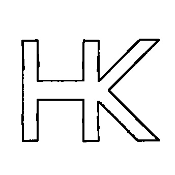

<!------ PROJECT TITLE ------>

    

    

<!------ WHAT ------>

    

<h1>🎀 Essence of the Project</h1>

The aim of this project is to create an occupancy grid for a mobile robot, essential for autonomous navigation. By forming a precise map, the robot can accurately interpret its environment, which is crucial for any advanced navigation strategy. I've integrated morphological techniques to enhance the map's utility and accuracy, refining the grid by smoothing and removing noise. This not only improves the robot's operational efficiency in complex environments but also optimizes its interaction with surroundings, facilitating effective path planning and obstacle avoidance.

  

 
  

<!------ WHY ------>

    

<h1>🎯 Project Vision</h1>

Project Vision is centered on developing a comprehensive occupancy grid mapping system for mobile robots, which is essential for autonomous navigation. The project aims to generate a detailed map that forms the foundation for sophisticated navigational strategies, ensuring accurate environmental interpretation and interaction. Key benefits of this advanced mapping approach include foundational mapping, which is critical for autonomous navigation, enabling precise environmental interpretation. Advanced morphological operations enhance mapping accuracy by smoothing out noise and refining the grid, thus improving navigational decisions. This approach optimizes the robot's path planning capabilities and enables effective obstacle avoidance, enhancing safety and reliability in autonomous operations.

 
  

<!------ HOW ------>

    

<h1>🪓Project Implementation</h1>

<h2>💠 Software Design & Tools </h2>

The Occupancy Grid Mapping project utilizes the Robot Operating System (ROS) within Ubuntu and Linux environments for robust, real-time map generation. Python scripts facilitate the creation and refinement of occupancy grids, employing Gazebo for simulations to evaluate mapping algorithms across diverse environments. RViz, enhanced with advanced visualization techniques including morphological filtering with OpenCV, improves visual insights and map building accuracy. This project integrates VS Code as the development environment.
    
 &nbsp;
 &nbsp;
 &nbsp;
 &nbsp;

 &nbsp;
 &nbsp;
 &nbsp;
 &nbsp;
 &nbsp;

  

<!------ Technical Terms ------>

<h2>💠 Project Technical Terms & Concepts </h2>

<h3>▸ Erosion</h3>

Erosion is a morphological process that shrinks the boundaries of the foreground object, effectively reducing noise and small details from an image. This technique is pivotal in eliminating irrelevant or extraneous structures that could impede the clarity of navigational pathways.

  

<h3>▸ What is Occupancy Grid Mapping</h3>

Occupancy Grid Mapping is a spatial representation technique used in robotics to model the environment as a grid of cells. Each cell in the grid represents a specific area of space and is assigned a probability that indicates whether the area is occupied by an obstacle, free, or unknown. This method provides a detailed and flexible way of mapping complex environments for navigation and planning in autonomous robots.

  

<h3>▸ What is the difference between Occupancy Grid Mapping and SLAM?</h3>

Occupancy Grid Mapping and SLAM (Simultaneous Localization and Mapping) are both crucial in autonomous navigation but serve different purposes. Occupancy Grid Mapping focuses on creating a map of the environment using sensor data to determine occupied and free spaces. In contrast, SLAM simultaneously creates a map of the environment while also tracking the robot's location within it, integrating localization with mapping to maintain accuracy in dynamic environments.

  

<h3>▸ Dilation</h3>

Dilation is the complementary process to erosion, expanding the boundaries of the foreground object in an image. It is often used to fill in small holes and connect disjointed elements, enhancing the map's structural integrity and ensuring essential navigational features are pronounced and easily interpretable.

  

<h3>▸ Are Erosion and Dilation on the generated map really useful?</h3>

Yes, applying erosion and dilation to the generated maps is highly beneficial in occupancy grid mapping. Erosion helps remove noise and unnecessary details that could clutter the map, while dilation ensures that important features and pathways are visible and connected. Together, these processes refine the map's quality, aiding robots in better navigation and obstacle avoidance, ultimately leading to more efficient and reliable autonomous operations.

  

<!------ Deployment and Testing ------>

<h2>💠 Deployment and Testing </h2>

The below images represents a visual representation of Occupancy Grid Mapping and Morphological Map Refinement within a robotic simulation environment. On the left, we see an initial occupancy grid map generated by a robot using LiDAR and odometry data, with various obstacles and free spaces indicated. The map on the right shows the outcome of applying morphological refinement techniques to the initial map, resulting in a cleaner, more navigable map. 

  

  

  

  

<!------ Result and Analysis ------>

<h2>💠 Results & Analysis </h2>

▸ Original Map Generated without Map Refinement:

  

▸ Map after Refinement using Erosion and Dilation:

  
  
  
  

 
    

<!------ End Image ------>

    

