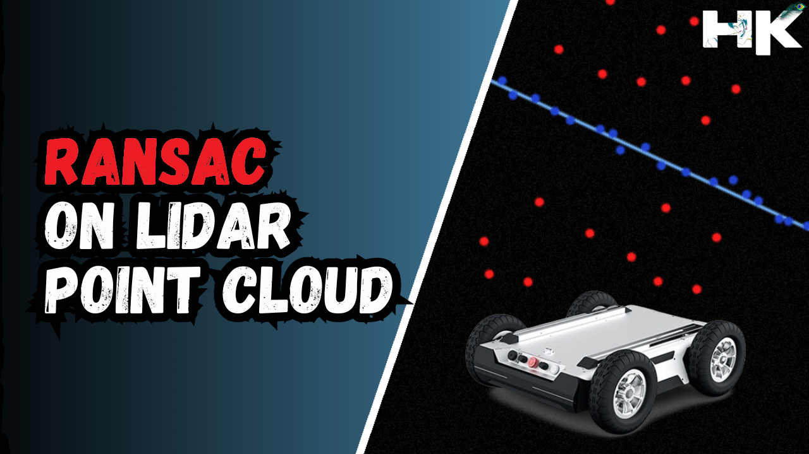
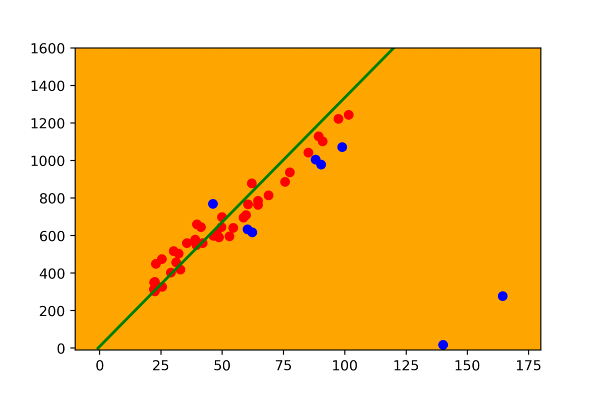

<!------ PROJECT TITLE ------>

    

    

<!------ WHAT ------>

    

 

<h1>🎀 Essence of the Project</h1>

Implementation of the RANSAC algorithm to refine LiDAR data for autonomous vehicles and robots. This technique filters out noise-induced outliers, ensuring that the most reliable inliers remain for accurate model estimation. The aim is to create a robust system for safe and efficient navigation, improving terrain mapping and obstacle avoidance.

  

 
  

<!------ WHY ------>

    

<h1>🎯 Project Vision</h1>

The project aims to leverage the RANSAC algorithm to optimize LiDAR data analysis for autonomous systems, enhancing the reliability of navigational pathways and ensuring that vehicles and robotics operate with increased accuracy and safety. The implementation brings critical advantages to autonomous navigation, including advanced outlier detection by using RANSAC on LiDAR data to identify and remove outliers, thereby maintaining only the most reliable data for model estimation. It also enhances navigation safety by improving the precision of terrain mapping and obstacle avoidance methodologies, and builds a robust system within the ROS framework, utilizing rospy for scripting and employing the F1Tenth Simulator alongside RViz for comprehensive simulation and visualization.

 
     

<!------ HOW ------>

    

<h1>🪓Project Implementation</h1>

<h2>💠 Software Design & Tools </h2>

The project's execution is centered on the strategic application of the RANSAC algorithm within the ROS framework, optimizing the extraction and utilization of LiDAR data for autonomous navigation. With meticulous integration of advanced computational tools and simulation environments, I established a robust methodology for enhancing the Lidar data processing pipeline. This includes scripting in rospy to facilitate real-time data analysis from the lidar and employing simulation platforms for testing and refining our models. The outcome is a sophisticated system poised to significantly advance the field of mobile robotics and autonomous vehicle navigation. 

 &nbsp;
 &nbsp;
 &nbsp;
 &nbsp;
 &nbsp;
 &nbsp;
 &nbsp;
 &nbsp;
 

<!------ Technical Terms ------>

<h2>💠 Project Technical Terms & Concepts</h2>

<h3>▸ What is RANSAC?</h3>

RANSAC (Random Sample Consensus) is an iterative method used in data analysis to estimate parameters of a mathematical model from a set of observed data that contains outliers. It is a robust algorithm designed to produce reliable estimates by repeatedly selecting random subsets of the data, fitting a model, and then determining how many of the remaining data points fit this model within a predefined tolerance.

  

    

  

<h3>▸ What are Outliers in Lidar Data</h3>

Outliers in LiDAR data are data points that do not fit the expected pattern or model, often caused by noise, errors in measurement, or objects that are not relevant to the analysis, such as birds, rain, or dust. These points can significantly skew the results of data analysis if not properly managed.

  

<h3>▸ What are Inliers in Lidar Data</h3>

Inliers in LiDAR data are the points that align well with the general model being used to represent the environment. These are the data points that reflect the actual physical surfaces in the environment, such as the ground, buildings, and other structures, and are crucial for accurate mapping and navigation.

  

<h3>▸ What is the whole purpose of using RANSAC on Lidar Data</h3>

The primary purpose of using RANSAC on LiDAR data is to effectively distinguish between inliers and outliers, allowing for the construction of an accurate model of the environment with minimal influence from noise and erroneous measurements. This enhances the reliability and precision of applications such as autonomous navigation, terrain mapping, and obstacle detection.

  

<h3>▸ Apart from RANSAC, are there any other methods?</h3>

Yes, apart from RANSAC, there are several other robust estimation methods used to handle outliers in data analysis, including methods like the Least Median of Squares (LMedS), Maximum Likelihood Estimation (MLE), and other iterative techniques that aim to optimize the fit of a model to the data by minimizing the effect of outliers.

  

<!------ Deployment and Testing ------>

<h2>💠 Deployment and Testing </h2>

    

    

    

<!------ Result and Analysis ------>

<h2>💠 Results & Analysis </h2>

The implementation of the RANSAC algorithm on the LiDAR data has been successful in removing outliers. The refined data now presents a more accurate representation of the environment, allowing for improved navigational decisions and path planning in autonomous systems.

 
  

<!------ End Image ------>

    

