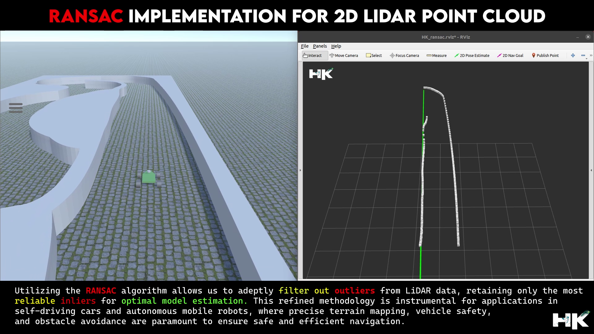

<!------ PROJECT TITLE ------>

    

    

<!------ WHAT ------>

    

 

<h1>🎀 Essence of the Project</h1>

Implementation of the RANSAC algorithm to refine LiDAR data for autonomous vehicles and robots. This technique filters out noise-induced outliers, ensuring that the most reliable inliers remain for accurate model estimation. The aim is to create a robust system for safe and efficient navigation, improving terrain mapping and obstacle avoidance.

  

 
  

<!------ WHY ------>

    

<h1>🎯 Project Vision</h1>

The project aims to leverage the RANSAC algorithm to optimize LiDAR data analysis for autonomous systems, enhancing the reliability of navigational pathways and ensuring that vehicles and robotics operate with increased accuracy and safety. The implementation brings critical advantages to autonomous navigation, including advanced outlier detection by using RANSAC on LiDAR data to identify and remove outliers, thereby maintaining only the most reliable data for model estimation. It also enhances navigation safety by improving the precision of terrain mapping and obstacle avoidance methodologies, and builds a robust system within the ROS framework, utilizing rospy for scripting and employing the F1Tenth Simulator alongside RViz for comprehensive simulation and visualization.

 
     

<!------ HOW ------>

    

<h1>🪓Project Implementation</h1>

<h2>💠 Software Design & Tools </h2>

The project's execution is centered on the strategic application of the RANSAC algorithm within the ROS framework, optimizing the extraction and utilization of LiDAR data for autonomous navigation. With meticulous integration of advanced computational tools and simulation environments, I established a robust methodology for enhancing the Lidar data processing pipeline. This includes scripting in rospy to facilitate real-time data analysis from the lidar and employing simulation platforms for testing and refining our models. The outcome is a sophisticated system poised to significantly advance the field of mobile robotics and autonomous vehicle navigation. 

 &nbsp;
 &nbsp;
 &nbsp;
 &nbsp;
 &nbsp;
 &nbsp;
 &nbsp;
 &nbsp;
 

<!------ Deployment and Testing ------>

<h2>💠 Deployment and Testing </h2>

    

    

    

<!------ Result and Analysis ------>

<h2>💠 Results & Analysis </h2>

The implementation of the RANSAC algorithm on the LiDAR data has been successful in removing outliers. The refined data now presents a more accurate representation of the environment, allowing for improved navigational decisions and path planning in autonomous systems.

 
  

<!------ End Image ------><!------ End Image ------><!------ End Image ------>

    

