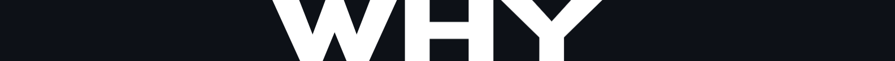

<!------ Copyrights ------>

© 𝗗𝗼𝗰𝘂𝗺𝗲𝗻𝘁𝗮𝘁𝗶𝗼𝗻 𝗯𝘆 𝘁𝘃𝗵𝗮𝗿𝗶𝗸𝗿𝗶𝘀𝗵𝗻𝗮

5 𝘮𝘪𝘯𝘶𝘵𝘦 𝘳𝘦𝘢𝘥 📚 
  

<!------ PROJECT TITLE ------>

    

    

<!------ WHAT ------>

    

<h1>🀠Essence of the Project</h1>

Implementation of the RANSAC algorithm to refine LiDAR data for autonomous vehicles and robots. This technique filters out noise-induced outliers, ensuring that the most reliable inliers remain for accurate model estimation. The aim is to create a robust system for safe and efficient navigation, improving terrain mapping and obstacle avoidance.

  

    

<!------ WHY ------>

    

<h1>🯠Project Vision</h1>

Project Vision is geared towards harnessing the RANSAC algorithm to optimize LiDAR data analysis for autonomous systems. This initiative is pivotal in sculpting a reliable navigational pathway, ensuring that vehicles and robotics operate with heightened accuracy and safety. Below, we delve into the critical advantages that this implementation brings to the field of autonomous navigation.

▸ <code>Advanced Outlier Detection:</code> Utilizing RANSAC on LiDAR data to adeptly identify and remove outliers, thereby preserving only the most trustworthy data for model estimation.

▸ <code>Navigation Safety:</code> Enhancing the safety and efficiency of autonomous navigation by improving the precision of terrain mapping and obstacle avoidance methodologies.

▸ <code>Robust Implementation:</code> Building a formidable system within the ROS framework, utilizing rospy for scripting, and employing F1Tenth Simulator alongside RViz for comprehensive simulation and visualization.

 

  <table align="center">
    <tr>
      <td></td>
      <td></td>
    </tr>
  </table>

   

<!------ HOW ------>

    

<h1>🪓Project Implementation</h1>

<h2>💠 Software Design & Tools </h2>

The project's execution is centered on the strategic application of the RANSAC algorithm within the ROS framework, optimizing the extraction and utilization of LiDAR data for autonomous navigation. With meticulous integration of advanced computational tools and simulation environments, I established a robust methodology for enhancing the data processing pipeline. This includes scripting in rospy to facilitate real-time data analysis and employing simulation platforms for testing and refining our models. The outcome is a sophisticated system poised to significantly advance the field of mobile robotics and autonomous vehicle navigation. 

 &nbsp;
 &nbsp;
 &nbsp;
 &nbsp;
 &nbsp;
 &nbsp;
 &nbsp;
 &nbsp;
 

<!------ Deployment and Testing ------><!------ Deployment and Testing ------><!------ Deployment and Testing ------>

<h2>💠 Deployment and Testing </h2>

▸ ADD TEXT HERE
▸ ADD TEXT HERE 
▸ ADD TEXT HERE 

<!------ Result and Analysis ------><!------ Result and Analysis ------><!------ Result and Analysis ------>

<h2>💠 Results & Analysis </h2>

▸ ADD TEXT HERE
▸ ADD TEXT HERE 
▸ ADD TEXT HERE 

<!------ End Image ------><!------ End Image ------><!------ End Image ------>

    

