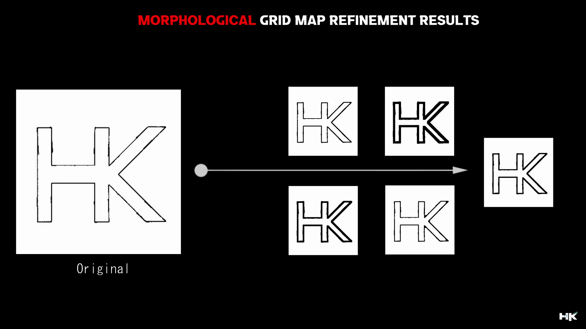

<!------ Copyrights ------>

© 𝗗𝗼𝗰𝘂𝗺𝗲𝗻𝘁𝗮𝘁𝗶𝗼𝗻 𝗯𝘆 𝘁𝘃𝗵𝗮𝗿𝗶𝗸𝗿𝗶𝘀𝗵𝗻𝗮

5 𝘮𝘪𝘯𝘶𝘵𝘦 𝘳𝘦𝘢𝘥 📚 
  

<!------ PROJECT TITLE ------>

    

    

<!------ WHAT ------>

    

<h1>🀠Essence of the Project</h1>

▸ The aim of this project is to create an occupancy grid for a mobile robot, which is vital for autonomous navigation. A precise map forms the basis for any advanced navigation strategy, ensuring the robot can accurately interpret its environment. 

▸ To enhance the map's utility and accuracy, I've integrated morphological techniques, which refine the grid by smoothing and removing noise, thereby improving the robot's operational efficiency in complex environments. This approach not only solidifies the foundation for navigation but also optimizes the robot's interaction with its surroundings, facilitating more effective path planning and obstacle avoidance strategies. 

  

    

<!------ WHY ------>

    

<h1>🯠Project Vision</h1>

Project Vision is geared towards developing a comprehensive occupancy grid mapping system for mobile robots, crucial for autonomous navigation. This project is designed to generate a detailed map that serves as a bedrock for sophisticated navigational strategies, ensuring accurate environmental interpretation and interaction. Below, we explore the pivotal benefits of implementing advanced mapping techniques in robotic autonomy.

▸ <code>Foundational Mapping:</code> The project establishes a foundational occupancy grid that is critical for the autonomous navigation of mobile robots, enabling precise environmental interpretation.

▸ <code>Morphological Enhancements:</code> By applying advanced morphological operations, the mapping accuracy is significantly enhanced, smoothing out noise and refining the grid for improved navigational decisions.

▸ <code>Navigational Efficacy:</code> This mapping approach solidifies the robot's navigation framework, optimizing its path planning capabilities and enabling effective obstacle avoidance for safer and more reliable autonomy.

    

<!------ HOW ------>

    

<h1>🪓Project Implementation</h1>

<h2>💠 Software Design & Tools </h2>

The Occupancy Grid Mapping project utilizes the Robot Operating System (ROS) within Ubuntu and Linux environments for robust, real-time map generation. Python scripts facilitate the creation and refinement of occupancy grids, employing Gazebo for simulations to evaluate mapping algorithms across diverse environments. RViz, enhanced with advanced visualization techniques including morphological filtering with OpenCV, improves visual insights and map building accuracy. This project integrates VS Code as the development environment.
    
 &nbsp;
 &nbsp;
 &nbsp;
 &nbsp;

 &nbsp;
 &nbsp;
 &nbsp;
 &nbsp;
 &nbsp;

  

<!------ Deployment and Testing ------>

<h2>💠 Deployment and Testing </h2>

The below images represents a visual representation of Occupancy Grid Mapping and Morphological Map Refinement within a robotic simulation environment. On the left, we see an initial occupancy grid map generated by a robot using LiDAR and odometry data, with various obstacles and free spaces indicated. The map on the right shows the outcome of applying morphological refinement techniques to the initial map, resulting in a cleaner, more navigable map. 

  

  

  

  

<!------ Result and Analysis ------>

<h2>💠 Results & Analysis </h2>

<h2>▸ Original Map Generated without Map Refinement:</h2>

  

<h2>▸ Map after Refinement using Erosion and Dilation</h2>

<h3>• Erosion</h3>

Erosion is a morphological process that shrinks the boundaries of the foreground object, effectively reducing noise and small details from an image. This technique is pivotal in eliminating irrelevant or extraneous structures that could impede the clarity of navigational pathways.

<h3>• Dilation</h3>

Dilation is the complementary process that expands the boundaries of the foreground object, often used to fill in small holes and connect disjointed elements in an image. By applying dilation, the map's structural integrity is enhanced, ensuring that essential navigational features are pronounced and easily interpretable.

  
  
  
  

<!------ End Image ------><!------ End Image ------><!------ End Image ------>

    

