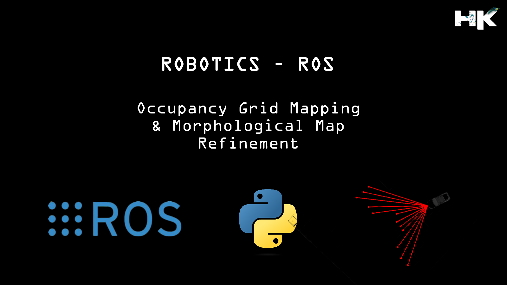
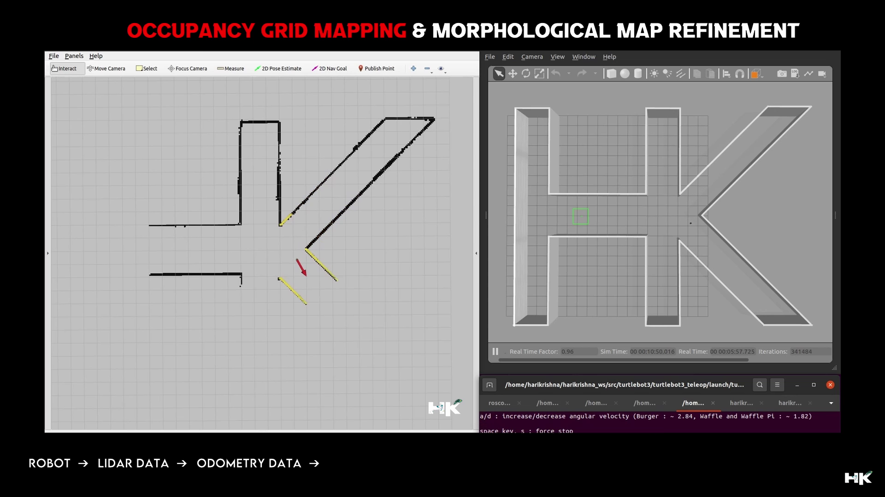
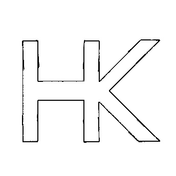

<h1 align="center"> 2 Dimensional Occupancy Grid Mapping </h1>

  

---------------------------------------------

## ▶ About this Project:
My objective is to generate an 𝗼𝗰𝗰𝘂𝗽𝗮𝗻𝗰𝘆 𝗴𝗿𝗶𝗱 for a 𝗺𝗼𝗯𝗶𝗹𝗲 𝗿𝗼𝗯𝗼𝘁, a critical foundation for autonomous navigation. Before any advanced navigation processes can commence, having a 𝗽𝗿𝗲𝗰𝗶𝘀𝗲 𝗺𝗮𝗽 is imperative. Alongside the occupancy grid generation, I've employed 𝗺𝗼𝗿𝗽𝗵𝗼𝗹𝗼𝗴𝗶𝗰𝗮𝗹 𝘁𝗲𝗰𝗵𝗻𝗶𝗾𝘂𝗲𝘀 𝗳𝗼𝗿 𝗺𝗮𝗽 𝗲𝗻𝗵𝗮𝗻𝗰𝗲𝗺𝗲𝗻𝘁.

---------------------------------------------

## ▶ What is Occupancy Grid and Why Map Refinement is Important:
Occupancy Grid Maps are fundamental approach in robotics that allows the creation of a detailed map by dividing the environment into a grid and marking each cell as occupied, empty, or unknown based on sensor readings, typically from LiDAR or sonar sensors.

Building on this, the project applies Morphological Map Refinement, a process that refines the raw grid map into a more usable form. This involves techniques from mathematical morphology, such as dilation and erosion, to remove noise and fill in gaps in the map, resulting in more accurate navigation paths for the robot. The synergy between precise sensor data and sophisticated processing algorithms empowers the robot to interact with complex environments more effectively.

---------------------------------------------

## ▶ Project Observations:
The below images represents a visual representation of Occupancy Grid Mapping and Morphological Map Refinement within a robotic simulation environment. On the left, we see an initial occupancy grid map generated by a robot using LiDAR and odometry data, with various obstacles and free spaces indicated. The map on the right shows the outcome of applying morphological refinement techniques to the initial map, resulting in a cleaner, more navigable map.

  

  

  

---------------------------------------------

## ▶ Original Map Generated without Map Refinment:

  

---------------------------------------------

## ▶ Map after Refinment using Erosion and Dilation

### • Erosion
  Erosion is a morphological process that shrinks the boundaries of the foreground object, effectively reducing noise and small details from an image.

### • Dilation 
  Dilation is the complementary process that expands the boundaries of the foreground object, often used to fill in small holes and connect disjointed elements in an image.

  
  
  
  

---------------------------------------------

## ▶ My Project Video Demonstration:

  
  

---------------------------------------------
