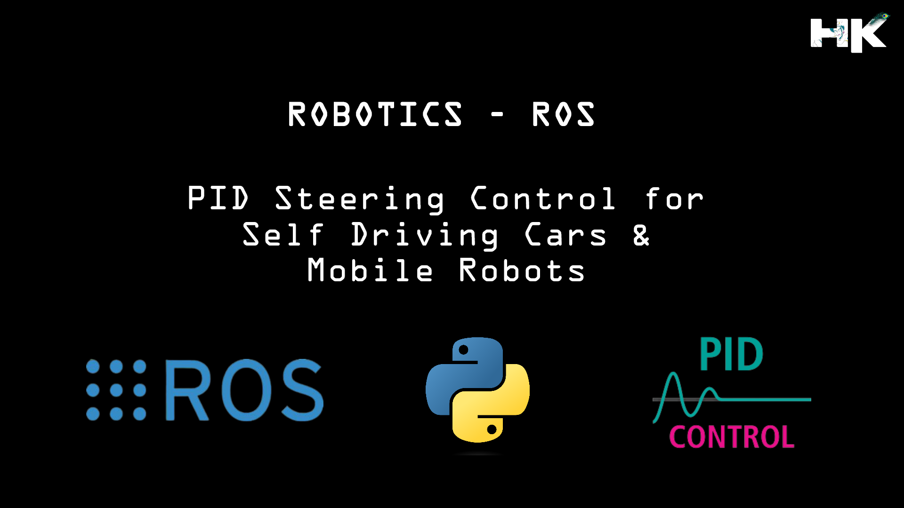

<h1 align="center">PID Steering Controller for Mobile Robots &amp; Self Driving Cars</h1>

  

---------------------------------------------

## ▶ About this Project:
A Proportional-Integral-Derivative (PID) Controller is a fundamental feedback loop mechanism widely utilized in control systems for motion planning. Its versatility allows it to be applied in numerous robotics and autonomous systems to 
achieve precise and stable movement. At the heart of this project lies the implementation of a PID Controller, designed to manage the dynamic response of an autonomous vehicle as it follows a designated path. The PID Controller adjusts 
the vehicle's steering based on real-time feedback to minimize the deviation.
 
This precise control is essential across various applications, from manufacturing robots that require exact movement patterns to maintain efficiency, to self-driving cars that need to navigate complex environments while adjusting to 
changing conditions. The project showcases how PID control can be tuned to optimize performance, reflecting its critical role in enhancing the reliability and accuracy of automated systems.

---------------------------------------------

## ▶ Working of PID Controller:

The PID (Proportional-Integral-Derivative) controller is a control loop feedback mechanism widely used in industrial control systems. It adjusts the output to bring a process to its desired setpoint or target. Here’s a brief explanation of how each component works:

  

### <strong> • Proportional (P) Term: </strong> 
This is the reactive part of the controller. It produces an output value that is proportional to the current error value the difference between the desired setpoint and the current process variable. A higher proportional gain results in a larger output response to the error, which can improve the system's response time but also increase the risk of overshooting the setpoint.

### <strong>  • Integral (I) Term: </strong> 
This component sums the error over time and integrates it with respect to the past errors. The integral term accelerates the movement of the process towards the setpoint and eliminates the residual steady-state error that occurs with a pure proportional controller. However, too much integral action can lead to instability and oscillations.

### <strong>  • Derivative (D) Term: </strong> 
The derivative term predicts system behavior and thus can provide a damping effect. It is a measure of how quickly the process variable is changing and effectively slows down the output to prevent overshooting. It can improve stability and settle time.

The PID controller works by calculating an 'error value' as the difference between a measured process variable and a desired setpoint. The controller attempts to minimize the error by adjusting the process control inputs. The combination of these three terms provides control action designed to eliminate the error by adjusting process control variables such as the throttle, the steering angle, or the valve position in a system.

---------------------------------------------

## ▶ Advantages of PID Controller:
    • Precision: PID controllers excel in systems where precision is paramount, providing exact control of the process and minimizing steady-state errors.
    • Stability: They help to stabilize a system's response and reduce overshoot, contributing to the reliability of the control process.
    • Flexibility: PID control loops are highly adaptable, allowing for fine-tuning of the Proportional, Integral, and Derivative terms to fit a wide range of applications.
    • Efficiency: By optimizing the control effort, PID controllers can improve the energy efficiency of systems, leading to cost savings.
    • Simplicity and Cost-effectiveness: Despite their effectiveness, PID controllers are relatively simple to design and implement, making them a cost-effective solution for many control problems.
    • Universality: PID controllers are a standard tool in the industry, used in countless applications due to their robust performance in various conditions.
    
---------------------------------------------

## ▶ How to implement PID Steering for a Mobile Robot in ROS:

  

### • Assign Waypoints and Visualize Them
Start by defining the desired path for the mobile robot through waypoints. Use visualization tools available in ROS, such as RViz, to plot these waypoints on a map. This helps in both planning the route and monitoring the robot's progress during execution.

### • Set Up PID Coefficients and Variables
Configure the PID controller with appropriate coefficients—proportional (Kp), integral (Ki), and derivative (Kd)—tailored to your specific robot. These values determine how the robot reacts to the difference between its current position and the waypoints (the error). You'll also need to set up vehicle-specific variables, such as maximum speed and turning angles.

### • Obtain Real-Time Odometry Information
Gather real-time odometry data from the robot's sensors. This data provides the robot's current position and orientation, which is crucial for calculating the error in the following steps.

### • Determine y-error Based on the Reference Trajectory
Calculate the lateral error (y-error) of the robot from its desired path. The y-error is the perpendicular distance from the robot to the closest point on the reference trajectory or the next waypoint.

### • Utilize Proportional Control
Apply proportional control to correct the robot's alignment with the path. The proportional term adjusts the robot's steering angle in proportion to the y-error, aiming to reduce the error over time.

### • Implement Integral Control
Use integral control to address any cumulative drift from the desired trajectory. This term sums the historical errors over time and applies corrections to eliminate bias and steady-state error.

### • Employ Derivative Control
Incorporate derivative control to anticipate future errors. It provides a damping force that reduces the rate of error change, preventing the robot from overshooting the path.

### • Combine P, I, D Responses
Combine the outputs of the P, I, and D terms to calculate the total steering command. The combined control signal is used to dynamically adjust the robot's steering to follow the path accurately.

### • Adjust the Drive Command
Adjust the robot's throttle or drive commands based on the control output to align its speed with the curvature of the path and current steering adjustments.

### • Steer the Robot
Finally, use the computed control inputs to steer the robot along the path. Monitor the robot's progress and continuously adjust the control signals to maintain a smooth and accurate trajectory.

---------------------------------------------

## ▶ Why Do We Need to Tune a PID Controller?

Tuning a PID controller is an essential step in any control system that employs feedback. Proper tuning ensures that the system responds to setpoint changes and disturbances rapidly and with minimal overshoot. Untuned or poorly tuned PID controllers can lead to inefficient operation, instability, excessive oscillation, or slow response times, all of which can affect the performance and safety of the controlled system. Effective tuning optimizes the control actions of the PID controller, ensuring it works in harmony with the dynamics of the process it is controlling. It is a delicate balance: the proportional term must be high enough to respond to changes, the integral term must correct any offset without causing instability, and the derivative term must predict and smooth the response. Without tuning, the controller cannot fulfill its role of maintaining the desired level of process control.

---------------------------------------------

## ▶ PID Tuning Methods:

1. Manual Tuning
2. Trial and Error Tuning
3. Ziegler-Nichols Tuning Method
4. Cohen-Coon Tuning Method
5. Kappa-Tau Tuning Method

For a deeper understanding and guidance on PID tuning, consider visiting [PID Tuning Methods](https://www.incatools.com/pid-tuning/pid-tuning-methods/). This resource provides insights and practical advice on how to apply these methods to achieve a well-tuned control system.

---------------------------------------------

## ▶ My Project Video Demonstration:

  

 
