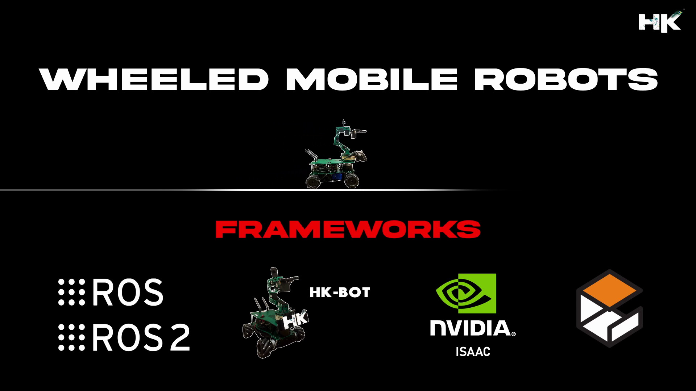
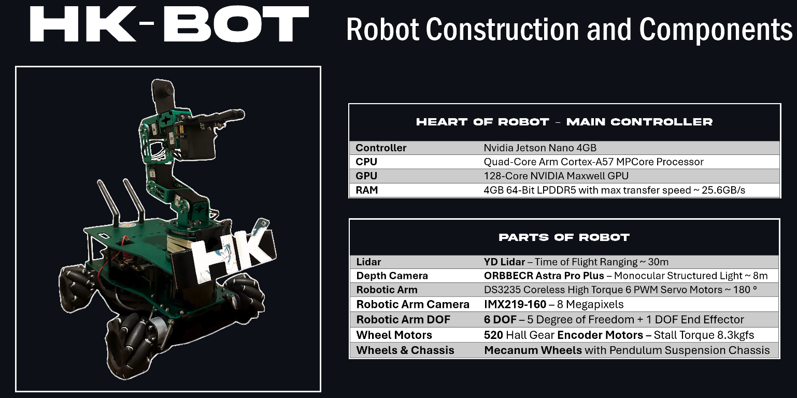

© 𝗗𝗼𝗰𝘂𝗺𝗲𝗻𝘁𝗮𝘁𝗶𝗼𝗻 𝗯𝘆 𝘁𝘃𝗵𝗮𝗿𝗶𝗸𝗿𝗶𝘀𝗵𝗻𝗮

1 𝘮𝘪𝘯𝘶𝘵𝘦 𝘳𝘦𝘢𝘥 📚
 

    

  

<h1 align="left">🔻 Repository Details</h1>

This repository contains a variety of motion planning algorithms tailored for wheeled mobile robots. Hands-on robotics projects are developed using HKBOT, while simulations are conducted in Gazebo and Nvidia Isaac environments.

<table align="center">
<thead>
<tr>
<th align="center">Naming Prefix</th>
<th align="center">Description</th>
</tr>
</thead>
<tbody>
<tr>
<td align="left"><strong>HKIsaac__</strong></td>
<td align="right">Simulations in Nvidia Isaac</td>
</tr>
<tr>
<td align="left"><strong>HKBOT__</strong></td>
<td align="right">Hands-on Mobile Robot</td>
</tr>
<tr>
<td align="left"><strong>HKROS__</strong></td>
<td align="right">Simulations in Gazebo</td>
</tr>
</tbody>
</table>

<h1>🔻 What are Autonomous Mobile Robots?</h1>

<code>AMR</code> are robots designed to perform tasks and navigate in their environment without direct human intervention. They use a combination of sensors, cameras, software algorithms, and sometimes artificial intelligence (AI) to perceive their surroundings, make decisions, and move with purpose towards a goal.

   

    
<table>
  <tr>
    <th align="center">Abbr</th>
    <th align="center">Robot Type</th>
    <th align="center">Robot Description</th>
  </tr>
  <tr>
    <td align="center"><strong>AMR</strong></td>
    <td align="center">Autonomous Mobile Robots</td>
    <td align="center">Autonomous Mapping and Navigation</td>
  </tr>
  <tr>
    <td align="center"><strong>AMMR</strong></td>
    <td align="center">Autonomous Mobile Manipulation Robots</td>
    <td align="center">AMR + Grasping and Manipulation of Objects</td>
  </tr>
</table>

  

<h1>🔻 What is HKBOT?</h1>

▸ HK Bot is an autonomous mobile robot which I have engineered with a deep passion for Robotics & AI. It is a sophisticated piece of technology that stands at the intersection of autonomous mobility and manipulative dexterity. 

    

  

This robot is designed for all applications related to Autonomous Mobile Robots <code>(AMRs)</code> and Autonomous Mobile Manipulation Robots <code>(AMMRs)</code>, leveraging state-of-the-art sensor technologies. With its advanced capabilities, the HK Bot can navigate, interact with the environment. The integration of advanced sensors and manipulators allows it to perform complex tasks autonomously.

 

    

    

  

    

