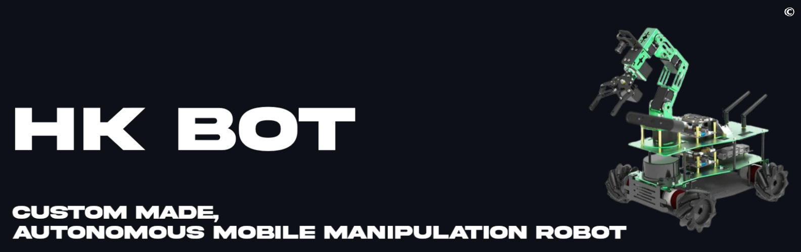
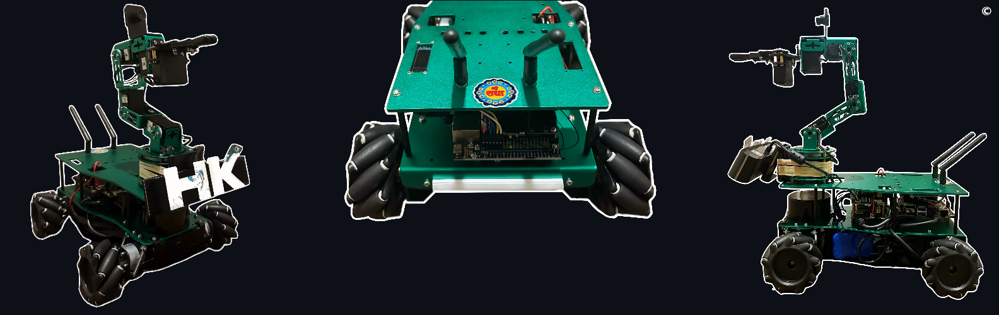
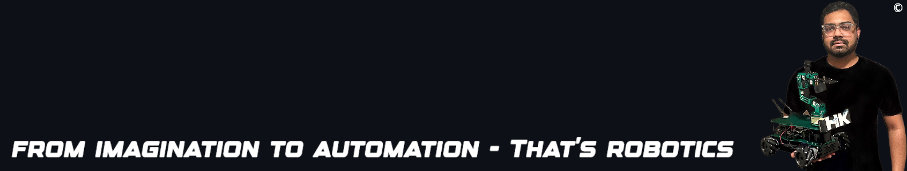

<!-- README: HariKrishn_ROSRobotics -->

<!-- Documentation and Read Time -->

© 𝗗𝗼𝗰𝘂𝗺𝗲𝗻𝘁𝗮𝘁𝗶𝗼𝗻 𝗯𝘆 𝘁𝘃𝗵𝗮𝗿𝗶𝗸𝗿𝗶𝘀𝗵𝗻𝗮

1 𝘮𝘪𝘯𝘶𝘵𝘦 𝘳𝘦𝘢𝘥 📚

<!-- Repo Details -->
<h1 align="left">🔻 Repository Details</h1>
<table align="center">
<thead>
<tr>
<th align="center">Naming Prefix</th>
<th align="center">Description</th>
</tr>
</thead>
<tbody>
<tr>
<td align="center">HKIsaac</td>
<td align="center">Simulation made in ROS-Gazebo</td>
</tr>
<tr>
<td align="center">HKROS</td>
<td align="center">Simulations made in Nvidia Isaac</td>
</tr>
<tr>
<td align="center">HKBOT</td>
<td align="center">Hands-on Custom made mobile robot</td>
</tr>
</tbody>
</table>

<!-- Section: What is ROS? -->
<h1>🔻 What is Robot Operating System (ROS)?</h1>

The Robot Operating System (ROS) is an exceptionally powerful set of tools and software libraries designed to assist developers in building and controlling sophisticated robots. It acts as a crucial bridge between robot hardware and software, efficiently facilitating communication and the seamless integration of complex software algorithms.

    

<!-- ROS Logo -->

    

  

<!-- Section: What are Wheeled Mobile Robots and Their Types? -->
<h1>🔻 What are Autonomous Mobile Robots?</h1>

<code>AMR</code> are robots designed to perform tasks and navigate in their environment without direct human intervention. They use a combination of sensors, cameras, software algorithms, and sometimes artificial intelligence (AI) to perceive their surroundings, make decisions, and move with purpose towards a goal.

   

    
<!-- Markdown table cannot be centered with div in GitHub Markdown, showing intent only -->
| AB | Robot Type | Robot Description |  
|------|-------------|----------|
| AMR  | Autonomous Mobile Robots | Autonomous Mapping and Navigation |
| AMMR | Autonomous Mobile Manipulation Robots | AMR + Grasping and Manipulation of Objects|

  

<!-- what is HKBOT -->
<h1>🔻 What is HKBOT?</h1>

▸ HK Bot is an autonomous mobile robot which I have engineered with a deep passion for robotics. It is a sophisticated piece of technology that stands at the intersection of autonomous mobility and manipulative dexterity. 

<!-- HKBOT Image -->

    

  

▸ This robot is designed for all applications related to Autonomous Mobile Robots <code>(AMRs)</code> and Autonomous Mobile Manipulation Robots <code>(AMMRs)</code>, leveraging state-of-the-art sensor technologies. With its advanced capabilities, the HK Bot can navigate, interact with the environment. The integration of advanced sensors and manipulators allows it to perform complex tasks autonomously, making it a versatile tool for the automation industry.

   

<!-- HKBOT Image -->

    

<!-- Components Details -->
<h2>💠Nvidia Jetson Nano</h2>

The Nvidia Jetson Nano is a small, powerful computer designed specifically for <code>Robotics and AI</code>. It delivers the compute performance to run modern AI workloads at unprecedented size, power, and cost.

<h2>💠YDLidar</h2>

YDLidar is a high-performance lidar specially built for ROS. It adopts the TOF ranging method, can resist up to 100KLux strong light radiation, supports both indoor and outdoor mapping and navigation, the measurement radius can reach 30m, and the measurement blind area is only 5cm. 

<h2>💠ORBBEC Astra Pro Plus Depth Camera</h2>

The ORBBEC Astra Pro Plus is a compact, reliable depth camera that provides high-resolution 3D scanning, gesture recognition, and tracking, making it a perfect choice for autonomous robotics where environmental perception and interaction are required. 

<h2>💠6DOF Robotic Arm</h2>

The robotic arm is built with 6 serial bus servos with repeat position accuracy of ± 0.5mm. With the robotic arm as the central axis, it can grasp objects within a radius of 30cm. It can handle objects of less than 500g, and provides the MoveIt ROS package for effective manipulation. 

<h2>💠Mecanum Wheels with Pendulum Suspension</h2>

The robot chassis is made of an aluminum alloy chassis, equipped with 4 Mecanum wheels and a pendulum suspension chassis design, which can make the robot have characteristics of a compact structure, flexible movement, and powerful maneuverability. The pendulum suspension chassis can allow HK Bot to adapt to uneven ground.
 

 
<!-- Component List Table -->
<!-- All components list -->

<table>
<tr>
    <td>Taillights</td>
    <td>CAN Bus Interface</td>
    <td>9-axis IMU</td>
    <td>USB Camera</td>
</tr>
<tr>
    <td>YD Lidar TG15</td>
    <td>Nvidia Jetson Nano</td>
    <td>End Effector</td>
    <td>RP-SMA jacks</td>
</tr>
<tr>
    <td>6DOF Robotic Arm</td>
    <td>520 Encoder Motors</td>
    <td>Astra Depth Camera</td>
    <td>USBHub Board</td>
</tr>
<tr>
    <td>Anti-Collision Beam</td>
    <td>9600mAh Lithium Battery</td>
    <td>ROS Expansion Board</td>
    <td>Heat Sink w/ PWM Fan</td>
</tr>
</table>

 

<h1>🔻 Tools & Technologies</h1>

 &nbsp;
 &nbsp;
 &nbsp;
 &nbsp;
 &nbsp;
 &nbsp;
 &nbsp;
 &nbsp;
 &nbsp;
 &nbsp;
 &nbsp;
 &nbsp;
 &nbsp;
 &nbsp;
 &nbsp;
 &nbsp;

    

