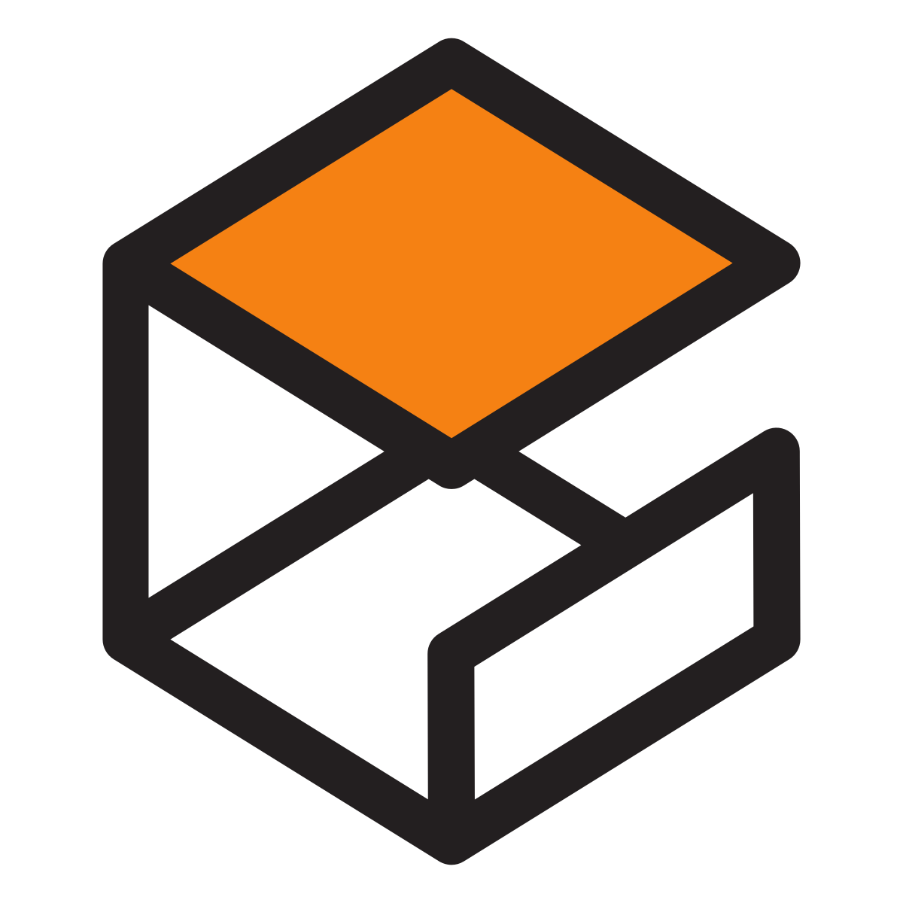
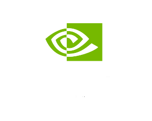
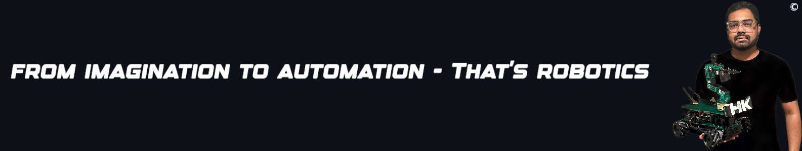

<!-- README: HariKrishn_ROSRobotics -->

<!-- Documentation and Read Time -->

© 𝗗𝗼𝗰𝘂𝗺𝗲𝗻𝘁𝗮𝘁𝗶𝗼𝗻 𝗯𝘆 𝘁𝘃𝗵𝗮𝗿𝗶𝗸𝗿𝗶𝘀𝗵𝗻𝗮

1 𝘮𝘪𝘯𝘶𝘵𝘦 𝘳𝘦𝘢𝘥 📚

<!-- Section: What is ROS? -->
<h1>🔻 What is Robot Operating System (ROS)?</h1>

The Robot Operating System (ROS) is an exceptionally powerful set of tools and software libraries designed to assist developers in building and controlling sophisticated robots. It acts as a crucial bridge between robot hardware and software, efficiently facilitating communication and the seamless integration of complex software algorithms.

  

<!-- ROS Logo -->

    

<!-- Section: What are Wheeled Mobile Robots and Their Types? -->
<h1>🔻 What are Autonomous Mobile Robots?</h1>

<code>AMR</code> are robots designed to perform tasks and navigate in their environment without direct human intervention. They use a combination of sensors, cameras, software algorithms, and sometimes artificial intelligence (AI) to perceive their surroundings, make decisions, and move with purpose towards a goal.

   

    
<!-- Markdown table cannot be centered with div in GitHub Markdown, showing intent only -->
| AB | Robot Type | Robot Description |  
|------|-------------|----------|
| AMR  | Autonomous Mobile Robots | Autonomous Mapping and Navigation |
| AMMR | Autonomous Mobile Manipulation Robots | AMR + Grasping and Manipulation of Objects|

  

<h1>🔻 Repository Simulators</h1>

The table below introduces the simulators used in this repository: Gazebo and NVIDIA Isaac Sim. Both of these powerful tools are instrumental for robotics simulation, each offering unique advantages that cater to different aspects of robotics development and testing.
  

<!-- HTML table centered -->

    <table>
        <tr>
            <th>Gazebo</th>
            <th>NVIDIA Isaac</th>
        </tr>
        <tr>
            <td></td>
            <td></td>
        </tr>
        <tr>
            <td>General Robotics Simulation</td>
            <td>Commercial Platform with a Focus on AI</td>
        </tr>
        <tr>
            <td>Supports Multiple Physics Engines</td>
            <td>Advanced Simulation for AI Robots</td>
        </tr>
        <tr>
            <td>Good Graphics Rendering</td>
            <td>Photorealistic Simulation</td>
        </tr>
        <tr>
            <td>Seamless Integration with ROS</td>
            <td>Physics and AI Integration</td>
        </tr>
        <tr>
            <td>Open Source</td>
            <td>Optimized for NVIDIA Hardware</td>
        </tr>
    </table>

 

<h1>🔻 Repository Overview</h1>

This repository documents my comprehensive journey through diverse projects in autonomous mobile robotics, including simulations performed using ROS, NVIDIA Isaac Sim, and Gazebo. Below are my project areas of focus, showcasing various applications and experiments. 
  

<!-- Markdown tables are automatically styled by GitHub and cannot be manually centered -->

    
| Autonomous Mapping Building | SLAM | Path Planning Algorithms |
|--------------------|--------------------------|--------------------------|
| Motion Control Algorithms           | Sensor Fusion Algorithms            | Environmental Modeling             |
| Robotics Manipulations | Robotics Perceptions (Non-AI/AI)                 | Navigation and Localization                  |

 

<h1>🔻 Valuable Resources</h1>  

<!-- Last table without centering as per request -->

<table>
  <tr>
    <th>Name</th>
    <th>Link</th>
  </tr>
  <tr>
    <td>Recommended Textbook for Mobile Robots</td>
    <td>
      
    </td>
  </tr>
  <tr>
    <td>NVIDIA Documentation</td>
    <td>
      
    </td>
  </tr>
  <tr>
    <td>Gazebo Documentation</td>
    <td>
      
    </td>
  </tr>
</table>

<h1>🔻 Tools & Technologies</h1>

 &nbsp;
 &nbsp;
 &nbsp;
 &nbsp;
 &nbsp;
 &nbsp;
 &nbsp;
 &nbsp;
 &nbsp;
 &nbsp;
 &nbsp;
 &nbsp;
 &nbsp;

    

