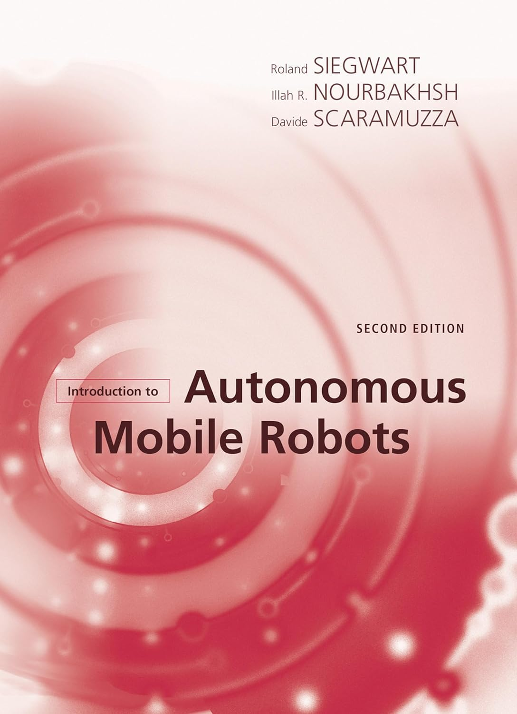

<!-- README: HariKrishn_ROSRobotics -->

<!-- Documentation and Read Time -->

© Documentation by tvharikrishna

1 minute read 📚

<!-- Section: What is ROS? -->
<h1>🔻 What is the Robot Operating System (ROS)?</h1>

Robot Operating System (ROS) is a powerful set of tools and software libraries designed to help developers build and control robots. It acts like a bridge for different parts of a robot to communicate, including sensors, motors, and software algorithms. ROS makes it easier to program robots by offering ready-to-use code and the ability to control hardware.

  

<!-- ROS Logo -->

    

  

<!-- Section: What are Wheeled Mobile Robots and Their Types? -->
<h1>🔻 What are Wheeled Mobile Robots?</h1>

<strong>Mobile Robot:</strong> A wheeled mobile robot is a type of robot that moves using wheels. This design allows for easier navigation and control in various environments, making them popular for tasks ranging from industrial automation to exploration.

<h3>💠 Types of Wheeled Mobile Robots</h3>

Below is a basic overview of wheeled mobile robots. These robots vary in wheel configuration (from 2-wheel to multi-wheel designs) and size, each tailored for different tasks. The list highlights key types to introduce the fundamentals of mobile robotics.

| Types | Description |
|------|-------------|
| AMR (Autonomous Mobile Robots) | Robots that can navigate and perform tasks in an environment without being directly controlled by a human. |
| AMMR (Autonomous Mobile Manipulation Robots) | Specialized in transporting and manipulating materials in environments like warehouses without human intervention. |
| AGV (Automated Guided Vehicles) | Vehicles that follow marked lines or wires on the floor, or use radio waves, vision cameras, magnets, or lasers for navigation. |
| UGV (Unmanned Ground Vehicles) | Robots that operate on the ground without a human onboard, used for a variety of tasks from surveillance to exploration. |

<h1>🔻 Repository Simulators</h1>

The table below introduces the simulators used in this repository: Gazebo and NVIDIA Isaac Sim. Both tools are instrumental for robotics simulation, each offering unique advantages.

| Gazebo | NVIDIA Isaac |
|-----------|--------------|
|  |  |
| General Robotics Simulation | Commercial Platform with a Focus on AI |
| Supports Multiple Physics Engines | Advanced Simulation for AI Robots |
| Good Graphics Rendering | Photorealistic Simulation |
| Seamless Integration with ROS | Physics and AI Integration |
| Open Source | Optimized for NVIDIA Hardware |

<h1>🔻 Repository Overview</h1>

This repository documents my comprehensive journey through diverse projects in autonomous mobile robotics, including simulations performed using ROS, NVIDIA Isaac Sim, and Gazebo. Below are my project areas of focus, showcasing various applications and experiments. These emphasize the integration of ROS in developing sophisticated robotic solutions and the use of simulation environments to test and refine autonomous robot behaviors before real-world deployment.

| Autonomous Mapping Building | SLAM  | Path Planning Algorithms |
|--------------------|--------------------------|--------------------------|
| Motion Control Algorithms           | Sensor Fusion Algorithms            | Environmental Modeling             |
| Robot Grasping & Manipulations | Robotics Perceptions                 | Navigation and Localization                  |

<h1>🔻 Valuable Sources</h1>

1) Recommended textbook for mobile robots: 
   - Book title: "Introduction to Autonomous Mobile Robots" by Roland Siegwart, Illah R. Nourbakhsh, and Davide Scaramuzza
   - 

    

2) NVIDIA Isaac Simulation:

3) Gazebo:
   - 

---

    

